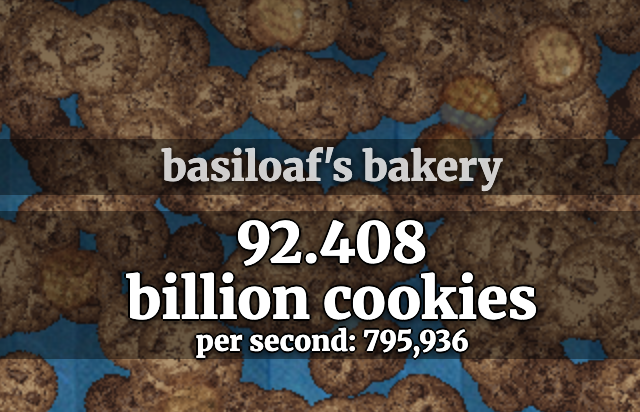

# Background

## What is cookie clicker?

Cookie clicker is an browser-based game my daughter introduced me to. The objective of the game is to get as many cookies as you can. You then spend these cookies to buy upgrades that give you even more cookies. In other words, spend cookies to earn cookies -- and get as many cookies as you can.

Fun!

## Why do you want to hack it?

I'm lazy, and wanted to earn all these cookies without playing the game.

Plus, I thought it would be a good use-case for me to learn Gemini-CLI on. So how do we hack a game?

## What are you hacking?

The game has an `export` function, where you can save your current progress to a long string of characers. Similarly it has an `import` function that enables you to resume your game from anywhere by loading in this string. The string looks like [this](/example_save_game.txt).

As you can see it looks like some weirdly encoded bunch of characters -- base64-ish, but something else. We'll learn more about the string later. The string **must** contain all details about your current state. Which means we can modify this state -- and give us a many cookies as we wanted. 

All this diabolical-ness is getting too exciting. Let's begin.

# Approach

I went to [cookieclicker.com](https://cookieclicker.com) and found a `main.js` file, which was conveniently the entire game in a single ~16,000 line file.

Luckily, `main.js` wasn't minified, and all human readable with comments.

I then bootstrapped a simple directory on my local mac with:

* A [jj](https://jj-vcs.github.io/jj/latest/) repository to track changes
* Initialized a [uv](https://docs.astral.sh/uv/) environment for my python code
* Add `black` and `pytest` to the my environment
* Drafted a small `GEMINI.md` file to instruct the agent
* Created two folders, `/src` and `/docs`. For code and docs.
* Copied `main.js` into the root directory.

Then I started up Gemini-CLI and starting working. 

For copyright purposes, I chose not to include main.js in this repo. But you can find it online.

## Did it work?

After about a day of ad-hoc programming, it finally worked. The full conversation between the agent and me is [here](/conversation.md), with some annotated notes from me. It's well-worth a skim through, as some of the next points only make sense if you read the conversation. I exported the conversation from the gemini-cli logs using [this script](/src/gemini_session_to_markdown.py).

## Did you manage to get all the cookies?

Yes, the final python code allowed me to modify any field, to get as many cookies,buildings, and upgrades/achievements I wanted. The agent also generated documentation about the program for me.

This line of code:

```python
# Modify values in parsed_data here ... 92 Billion cookies seems nice :)
parsed_data['main_stats']['cookies']=92401719440.323624
```

Gave me this:



## Did the agent do all the work?

No. I had to jump in to solve some problems the agent was stuck on. And I refactored and rewrote some of the code. This was more collaborative than supervisory, although I did had to supervise the agent -- it's attitude was akin to an over-eager intern, trying to temper down the excitement was a real challenge for me.

## Did the agent solve it in one prompt?

I don't believe any amount of prompting would have succeeded in a single prompt. 

There were 3 points in the conversation where the agent was caught in loop, and I had to manually escape it. It also encountered plenty problems that needed my expertise to solve. 

This is real code from the real-world, which means there's going to be real-world hacks and mistakes, something the agent didn't know how to handle well.

#  Lessons

## Research before doing

I had to first analyze the 16,000 lines of Javascript. I asked Gemini to write documentation, starting at a high level and then drilling deeper into areas I knew I wanted to cover. One `.md` file per document in my `/docs` folder.

I read every bit of documentation, so that my knowledge of the running program was also growing over time. This allowed me to guide the agent better.

I think the trick was the human actually reading the documentation -- if you expect the AI to write documentation for the AI (and only the AI) to read, it's less effective. Human in the loop only works if the human knows what's going on.

## Plan before doing

Asking the agent for a plan before it begins executing is probably the biggest lesson I learnt.

Twice in the conversation I had to stop the agent from executing, and instead asked it for a plan of how to resolve the issue. Success rates are better if the agent writes a plan, especially for a large change. Occassionally you'll have to tweak the plan as well, but generally spend one prompt creating a plan before the agent executes.

## Dual screen terminals for the win

I asked the agent to output documentation to `.md` files in markdown. On a split screen terminal I have Gemini-CLI on one terminal, and another terminal for everything else. I used `glow` to view `.md` files and `nvim` to modify if needed. 

But when I needed to really debug, I dropped into VSCode, I still prefer debugging in a visual editor. This split terminal allowed to read the documents the agent produced and then continue prompting it by referencing specific areas of the document (e.g. section 2.1 of file a). 


## JJ

I'm also learning `jj` at the same time. JJ works a little better than git as it forced me to think about stuff **before** the commit rather than after. It also has a nicer log. The best part is that I would create a new commit in JJ, and then save the corresponding chat in gemini-cli via `/chat save commit-name` to allow to restore everything back in case the agent went hay-wire. 

Fortunately, the agent didn't go hay-wire and I never had to go back revisions. But knowing that I would be one `jj abandon` away from restoring everything was nice.

Learn more about jj [here](https://jj-vcs.github.io/jj/latest/)

## Small is better than Big

Everyone knows at least one Agile practioner who took agile a bit too dogmatically. But, at the core of Agile lies an important truth -- small changes over time are better than one big change all at once.

Asking the agent to perform big changes increases the chances of the agent looping forever. Big changes also mean more lines for me to read, which reduces the probability of me actually reading everything (or anything!)

I know some folks prefer spending time writing up the detail specification for the AI to write -- but if you wouldn't like to merge a 10,000 line PR, why ask the agent to generate 10,000 lines of code in one go.

## Guide the Agent

I've learnt over the years that there is one (maybe two) ways of doing things right -- but a million ways to do things wrong.

Everyone gets things wrong in their own unique way. Which means when an AI agent (trained on pattern recognition) sees a new 'hack' of an application, it probably doesn't have a clear understanding of what's going on, or how to address it. 

In this case, the agent hung trying to decode a file because the original author of `main.js` did a 'hacky' encoding of the string. It's only after you guide the agent was it able to resolve the issue. It's also the reason why I believe it's impossible to one-shot the solution to this problem. 

My 'guiding the agent' wasn't telling the agent what to do -- but asking it how it knows what it thinks it knows for sure. Just like any human, as it thinks about some area deeply, it gets insights and solves the problem. This is very eerily human -- not suprehuman -- but human!

## Refactoring is harder when code isn't yours

[Chesterton's fence](https://en.wikipedia.org/wiki/Wikipedia:Chesterton%27s_fence) states that you shouldn't remove something until you know why it was there in the first place.

It was hard for me to refactor the code, because I didn't write it -- so I didn't know what I could rewrite or remove.

This is why I had to write the test before refactoring. Maybe I should have asked the agent to write the test as well, and execute if before begining my refactoring. \

Perhaps TDD might make a comeback with these agents. If a human writes the test, and the agents work their darnest to make the test pass -- then maybe we solve some of the problems -- or introduce newer ones. Who knows! This is all too exciting for now.

## Vibe-coding can be addictive

At one point, I was resistant to actually make code changes. I noticed that I would rather ask the agent to do something than do it myself, even though it was a one liner change. I know people who can't drive 15 minutes from their home without a GPS map guiding them -- I'm afraid of the brain athrophy I would get if I vibe-code and no longer write the code with my own fingers.

Or maybe it was the fact, that developers have a natural resistance to touch someone else code. Especially the level of that code isn't as good as yours (low-key brag alert!). 

Either way, at some point, there is hesistation to actually code when you can just fire off commands and watch. This is perhaps the single biggest danger of 'vibe-coding'. 

